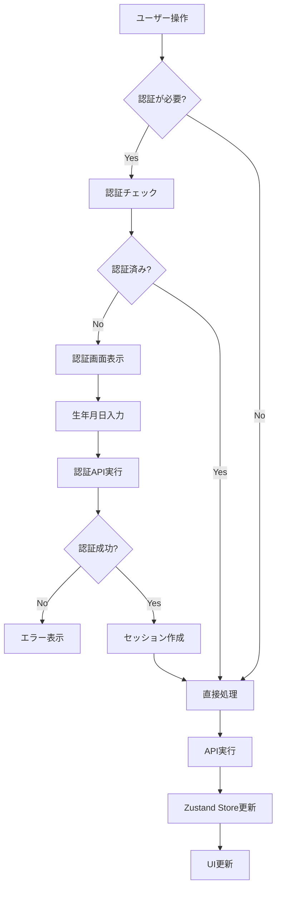
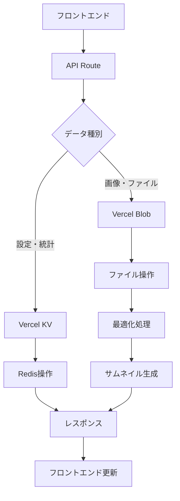
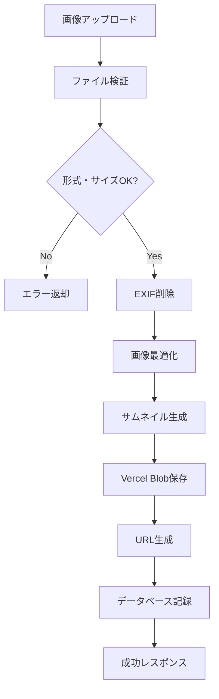

# 🔌 API設計仕様書

## 概要
ことちゃんバースデーアプリのAPI設計とデータフロー詳細仕様です。

---

## 🗂️ APIエンドポイント一覧

### 認証・セッション管理

#### POST `/api/auth/login`
管理者認証（生年月日ベース）

**Request Body:**
```typescript
{
  birthdate: string; // "YYYY-MM-DD" 形式
}
```

**Response:**
```typescript
{
  success: boolean;
  message: string;
  session?: {
    id: string;
    expiresAt: number;
  };
}
```

**Status Codes:**
- `200`: 認証成功
- `401`: 認証失敗
- `400`: リクエスト形式エラー
- `429`: レート制限

#### GET `/api/auth/session`
セッション状態確認

**Headers:**
```
Authorization: Bearer <session-id>
```

**Response:**
```typescript
{
  valid: boolean;
  expiresAt?: number;
  isAdmin?: boolean;
}
```

#### POST `/api/auth/logout`
セッション無効化

---

### 設定管理

#### GET `/api/settings/app`
アプリケーション設定取得

**Response:**
```typescript
{
  settings: {
    childName: string;
    birthday: string;
    theme: 'default' | 'custom';
    soundEnabled: boolean;
    albumAutoPlay: boolean;
    backgroundMusicVolume: number; // 0.0 - 1.0
    effectsVolume: number; // 0.0 - 1.0
  };
}
```

#### PUT `/api/settings/app`
アプリケーション設定更新

**Request Body:**
```typescript
{
  childName?: string;
  theme?: 'default' | 'custom';
  soundEnabled?: boolean;
  albumAutoPlay?: boolean;
  backgroundMusicVolume?: number;
  effectsVolume?: number;
}
```

**Response:**
```typescript
{
  success: boolean;
  message: string;
  settings: AppSettings;
}
```

#### GET `/api/settings/usage`
使用統計取得

**Response:**
```typescript
{
  stats: {
    soundPlay: number;
    drawing: number;
    album: number;
    admin: number;
    lastAccess: string;
    totalSessions: number;
    averageSessionLength: number; // 秒
  };
}
```

#### POST `/api/settings/usage`
使用統計記録

**Request Body:**
```typescript
{
  feature: 'soundPlay' | 'drawing' | 'album' | 'admin';
  sessionLength?: number;
}
```

---

### アルバム管理

#### GET `/api/album/photos`
写真一覧取得

**Query Parameters:**
```
limit?: number (default: 50)
offset?: number (default: 0)
category?: 'family' | 'birthday' | 'drawings'
```

**Response:**
```typescript
{
  photos: Array<{
    id: string;
    url: string;
    thumbnailUrl: string;
    caption?: string;
    category: 'family' | 'birthday' | 'drawings';
    createdAt: string;
    fileSize: number;
    width: number;
    height: number;
  }>;
  total: number;
  hasMore: boolean;
}
```

#### POST `/api/album/photos`
写真アップロード（管理者のみ）

**Request Body (multipart/form-data):**
```
file: File
caption?: string
category?: 'family' | 'birthday'
```

**Response:**
```typescript
{
  success: boolean;
  message: string;
  photo?: {
    id: string;
    url: string;
    thumbnailUrl: string;
    caption?: string;
    category: string;
    createdAt: string;
  };
}
```

#### DELETE `/api/album/photos/[id]`
写真削除（管理者のみ）

**Response:**
```typescript
{
  success: boolean;
  message: string;
}
```

#### PUT `/api/album/photos/[id]`
写真情報更新（管理者のみ）

**Request Body:**
```typescript
{
  caption?: string;
  category?: 'family' | 'birthday' | 'drawings';
}
```

---

### 描画管理

#### POST `/api/drawings/save`
描画保存

**Request Body (multipart/form-data):**
```
image: File (PNG/JPEG)
```

**Response:**
```typescript
{
  success: boolean;
  message: string;
  drawing?: {
    id: string;
    url: string;
    thumbnailUrl: string;
    createdAt: string;
  };
}
```

#### GET `/api/drawings`
描画一覧取得

**Query Parameters:**
```
limit?: number (default: 20)
offset?: number (default: 0)
```

**Response:**
```typescript
{
  drawings: Array<{
    id: string;
    url: string;
    thumbnailUrl: string;
    createdAt: string;
  }>;
  total: number;
  hasMore: boolean;
}
```

#### DELETE `/api/drawings/[id]`
描画削除（管理者のみ）

---

### ヘルスチェック

#### GET `/api/health`
サービス状態確認

**Response:**
```typescript
{
  status: 'healthy' | 'degraded' | 'unhealthy';
  timestamp: string;
  services: {
    database: 'up' | 'down';
    storage: 'up' | 'down';
    memory: number; // 使用率 %
  };
}
```

---

## 🔄 データフロー設計

### 1. ユーザー操作フロー



### 2. データ永続化フロー



### 3. 画像処理フロー



---

## 🗄️ データストア設計

### Vercel KV（Redis）スキーマ

#### セッション管理
```typescript
// Key: session:{sessionId}
interface SessionData {
  userId: 'admin';
  isAdmin: boolean;
  createdAt: number;
  expiresAt: number;
  lastAccess: number;
}
```

#### アプリケーション設定
```typescript
// Key: app:settings
interface AppSettings {
  childName: string;
  birthday: string; // YYYY-MM-DD
  theme: 'default' | 'custom';
  soundEnabled: boolean;
  albumAutoPlay: boolean;
  backgroundMusicVolume: number;
  effectsVolume: number;
  updatedAt: number;
}
```

#### 使用統計
```typescript
// Key: app:usage
interface UsageStats {
  soundPlay: number;
  drawing: number;
  album: number;
  admin: number;
  lastAccess: string;
  totalSessions: number;
  totalTime: number; // 秒
  dailyUsage: Record<string, number>; // YYYY-MM-DD: count
}
```

#### 写真メタデータ
```typescript
// Key: photo:{photoId}
interface PhotoMetadata {
  id: string;
  filename: string;
  originalName: string;
  caption?: string;
  category: 'family' | 'birthday' | 'drawings';
  blobUrl: string;
  thumbnailUrl: string;
  fileSize: number;
  width: number;
  height: number;
  createdAt: string;
  updatedAt: string;
}

// Key: photos:list
// Value: Array<string> (photo IDs ordered by creation date)
```

### Vercel Blob ファイル構造

```
/
├── albums/
│   ├── family/
│   │   ├── {year}/
│   │   │   ├── {photoId}.webp
│   │   │   └── {photoId}_thumb.webp
│   │   └── ...
│   ├── birthday/
│   │   └── {year}/
│   └── drawings/
│       └── {date}/
│           ├── {drawingId}.png
│           └── {drawingId}_thumb.png
└── cache/
    └── optimized/
```

---

## 🔒 セキュリティ実装

### レート制限
```typescript
// lib/middleware/rateLimit.ts
interface RateLimitConfig {
  windowMs: number;
  maxRequests: number;
  skipSuccessfulRequests?: boolean;
}

const rateLimits = {
  '/api/auth/login': { windowMs: 15 * 60 * 1000, maxRequests: 5 },
  '/api/upload/*': { windowMs: 60 * 1000, maxRequests: 10 },
  '/api/drawings/save': { windowMs: 60 * 1000, maxRequests: 5 },
};
```

### ファイルアップロード検証
```typescript
// lib/upload/validator.ts
interface FileValidationConfig {
  maxSize: number; // bytes
  allowedTypes: string[];
  allowedExtensions: string[];
}

const validationConfig = {
  photos: {
    maxSize: 10 * 1024 * 1024, // 10MB
    allowedTypes: ['image/jpeg', 'image/png', 'image/webp'],
    allowedExtensions: ['.jpg', '.jpeg', '.png', '.webp'],
  },
  drawings: {
    maxSize: 5 * 1024 * 1024, // 5MB
    allowedTypes: ['image/png', 'image/jpeg'],
    allowedExtensions: ['.png', '.jpg'],
  },
};
```

### CSP（Content Security Policy）
```typescript
// next.config.js
const ContentSecurityPolicy = `
  default-src 'self';
  script-src 'self' 'unsafe-eval' 'unsafe-inline';
  style-src 'self' 'unsafe-inline';
  img-src 'self' blob: data: https://*.vercel-storage.com;
  media-src 'self' blob:;
  connect-src 'self' https://*.vercel.app;
  font-src 'self';
  frame-src 'none';
  object-src 'none';
  base-uri 'self';
`;
```

---

## 📊 エラーハンドリング

### 統一エラーレスポンス
```typescript
interface ErrorResponse {
  success: false;
  error: {
    code: string;
    message: string;
    details?: any;
    timestamp: string;
  };
}

// エラーコード定義
enum ErrorCodes {
  UNAUTHORIZED = 'UNAUTHORIZED',
  FORBIDDEN = 'FORBIDDEN',
  NOT_FOUND = 'NOT_FOUND',
  VALIDATION_ERROR = 'VALIDATION_ERROR',
  FILE_TOO_LARGE = 'FILE_TOO_LARGE',
  UNSUPPORTED_FILE_TYPE = 'UNSUPPORTED_FILE_TYPE',
  RATE_LIMIT_EXCEEDED = 'RATE_LIMIT_EXCEEDED',
  INTERNAL_SERVER_ERROR = 'INTERNAL_SERVER_ERROR',
}
```

### ログ記録
```typescript
// lib/logging/logger.ts
interface LogEntry {
  timestamp: string;
  level: 'info' | 'warn' | 'error';
  message: string;
  context?: {
    userId?: string;
    sessionId?: string;
    endpoint?: string;
    userAgent?: string;
    ip?: string;
  };
  error?: Error;
}
```

---

## 🚀 パフォーマンス最適化

### キャッシュ戦略
```typescript
// Cache-Control headers
const cacheConfig = {
  '/api/album/photos': 'public, max-age=300, s-maxage=600', // 5分
  '/api/settings/app': 'private, max-age=60', // 1分
  '/api/health': 'no-cache',
  'static-assets': 'public, max-age=31536000, immutable', // 1年
};
```

### 画像最適化
```typescript
// lib/image/optimizer.ts
interface OptimizationOptions {
  quality: number;
  format: 'webp' | 'avif' | 'jpeg';
  maxWidth: number;
  maxHeight: number;
  progressive: boolean;
}

const optimizationSettings = {
  thumbnail: { quality: 80, maxWidth: 300, maxHeight: 300 },
  display: { quality: 85, maxWidth: 1200, maxHeight: 800 },
  original: { quality: 95, maxWidth: 2048, maxHeight: 2048 },
};
```

---

## 📈 監視・分析

### メトリクス収集
```typescript
// lib/analytics/metrics.ts
interface AppMetrics {
  pageViews: Record<string, number>;
  featureUsage: Record<string, number>;
  errorRates: Record<string, number>;
  responseTime: Record<string, number>;
  userSessions: {
    total: number;
    averageLength: number;
    bounceRate: number;
  };
}
```

### ヘルスチェック
```typescript
// api/health/route.ts
interface HealthCheck {
  status: 'healthy' | 'degraded' | 'unhealthy';
  checks: {
    database: boolean;
    storage: boolean;
    memory: number;
    diskSpace: number;
  };
  uptime: number;
  version: string;
}
```

---

この API設計に基づいて実装することで、安全で効率的な ことちゃんバースデーアプリ を構築できます。