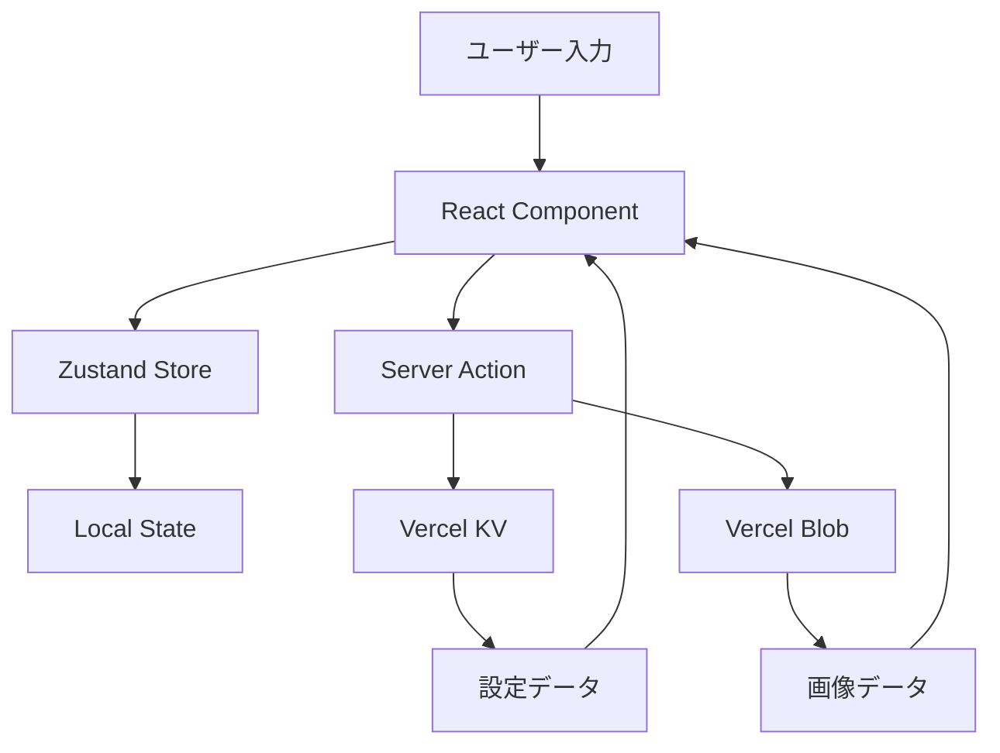

# 📱 ことちゃんバースデーアプリ 詳細仕様書・設計書

## 目次
1. [概要](#概要)
2. [技術スタック選定](#技術スタック選定)
3. [アーキテクチャ設計](#アーキテクチャ設計)
4. [セキュリティ設計](#セキュリティ設計)
5. [データベース設計](#データベース設計)
6. [UI/UX設計](#uiux設計)
7. [機能別詳細設計](#機能別詳細設計)
8. [デプロイメント計画](#デプロイメント計画)
9. [開発計画](#開発計画)

---

## 概要

### プロジェクト概要
- **名称**: ことちゃんバースデーアプリ
- **対象ユーザー**: ことちゃん（1歳）とその家族
- **主な目的**: 
  - 1歳児が安全に楽しめるタッチ操作ベースのWebアプリ
  - 家族の思い出を共有し、誕生日を特別に祝う
  - 成長の記録と家族のコミュニケーションツール

### コアバリュー
- **安全性**: 子供が安心して使える設計
- **シンプルさ**: 直感的で分かりやすいUI
- **楽しさ**: タッチで反応する楽しいインタラクション
- **記念性**: 家族の思い出を大切に保存

---

## 技術スタック選定

### フロントエンド
```yaml
フレームワーク: Next.js 14 (App Router)
理由: 
  - Vercelとの最高の相性
  - SSG/ISRによる高速な初回ロード
  - Image Optimizationによる画像最適化
  - Built-in PWA support

言語: TypeScript 5.3+
理由:
  - 型安全性による開発効率向上
  - 保守性の向上
  - エディタサポートの充実

スタイリング: Tailwind CSS 3.4 + CSS Modules
理由:
  - ユーティリティファーストで迅速な開発
  - パフォーマンス最適化（未使用CSSの削除）
  - コンポーネント固有のスタイルはCSS Modulesで管理

アニメーション: Framer Motion 11
理由:
  - React向けの最も成熟したアニメーションライブラリ
  - ジェスチャー対応
  - パフォーマンス最適化

状態管理: Zustand 4.5
理由:
  - 軽量でシンプルなAPI
  - TypeScript完全対応
  - React Server Componentsとの相性

音声再生: Howler.js 2.2
理由:
  - クロスブラウザ対応
  - モバイルでの自動再生制限への対処
  - 音声スプライトサポート

画像スライダー: Embla Carousel 8
理由:
  - 軽量で高性能
  - タッチジェスチャー完全対応
  - React向けAPI
```

### バックエンド・インフラ
```yaml
ホスティング: Vercel
理由:
  - Next.jsとの完璧な統合
  - 自動デプロイメント
  - エッジ関数によるグローバル配信
  - 無料枠で十分な性能

画像ストレージ: Vercel Blob
理由:
  - Vercelとのシームレスな統合
  - 自動画像最適化
  - CDN配信
  - 家族写真の安全な保存

データベース: Vercel KV (Redis)
理由:
  - セッション管理に最適
  - 高速なキー・バリューストア
  - サーバーレス対応
  - 設定情報の保存に適切

認証: カスタム実装（生年月日ベース）
理由:
  - シンプルな要件
  - 外部認証サービス不要
  - 子供に優しい設計

分析: Vercel Analytics
理由:
  - プライバシーファースト
  - リアルタイムデータ
  - パフォーマンス監視
```

### 開発ツール
```yaml
パッケージマネージャー: pnpm 8
理由:
  - 高速なインストール
  - ディスク容量の効率的な使用
  - monorepo対応

コード品質:
  - ESLint 8 (Next.js config)
  - Prettier 3
  - Husky + lint-staged
  - Commitlint

テスト:
  - Vitest (単体テスト)
  - Playwright (E2Eテスト)
  - React Testing Library

CI/CD:
  - GitHub Actions
  - Vercel自動デプロイ
  - Dependabot
```

---

## アーキテクチャ設計

### ディレクトリ構造
```
koto-chan-app/
├── app/                        # Next.js App Router
│   ├── (routes)/              # ルートグループ
│   │   ├── page.tsx           # ホーム画面
│   │   ├── sound-play/        # おとあそび
│   │   ├── drawing/           # おえかき
│   │   ├── album/             # アルバム
│   │   ├── admin/             # 管理画面（パス保護）
│   │   └── birthday/          # 誕生日特別画面
│   ├── api/                   # APIルート
│   │   ├── upload/            # 画像アップロード
│   │   ├── settings/          # 設定API
│   │   └── auth/              # 認証API
│   ├── layout.tsx             # ルートレイアウト
│   └── globals.css            # グローバルスタイル
├── components/                 # 再利用可能コンポーネント
│   ├── ui/                    # 基本UIコンポーネント
│   ├── features/              # 機能別コンポーネント
│   └── layouts/               # レイアウトコンポーネント
├── lib/                       # ユーティリティ関数
│   ├── hooks/                 # カスタムフック
│   ├── utils/                 # ヘルパー関数
│   └── constants/             # 定数定義
├── public/                    # 静的ファイル
│   ├── images/               
│   │   ├── stamps/            # スタンプ画像
│   │   ├── ui/                # UI素材
│   │   └── mockups/           # モックアップ画像
│   ├── sounds/                # 音声ファイル
│   └── fonts/                 # カスタムフォント
├── store/                     # Zustand store
├── types/                     # TypeScript型定義
└── config/                    # 設定ファイル
```

### データフロー設計


---

## セキュリティ設計

### 認証・認可
```typescript
// lib/auth/password.ts
export const ADMIN_BIRTHDAY = "2024-06-18";

export function validateAdminAccess(inputDate: string): boolean {
  // 生年月日形式の検証
  const dateRegex = /^\d{4}-\d{2}-\d{2}$/;
  if (!dateRegex.test(inputDate)) return false;
  
  // 定数時間比較でタイミング攻撃を防ぐ
  return cryptoSafeCompare(inputDate, ADMIN_BIRTHDAY);
}

// セッション管理
export async function createAdminSession(): Promise<string> {
  const sessionId = generateSecureToken();
  await kv.set(
    `session:${sessionId}`,
    { isAdmin: true, createdAt: Date.now() },
    { ex: 3600 } // 1時間で期限切れ
  );
  return sessionId;
}
```

### コンテンツセキュリティ
```typescript
// next.config.js
const securityHeaders = [
  {
    key: 'X-Frame-Options',
    value: 'DENY'
  },
  {
    key: 'Content-Security-Policy',
    value: ContentSecurityPolicy.replace(/\n/g, '')
  },
  {
    key: 'X-Content-Type-Options',
    value: 'nosniff'
  }
];

const ContentSecurityPolicy = `
  default-src 'self';
  script-src 'self' 'unsafe-eval' 'unsafe-inline' vercel.live;
  style-src 'self' 'unsafe-inline';
  img-src 'self' blob: data: https:;
  font-src 'self';
  media-src 'self' blob:;
  connect-src 'self' https://vercel.live;
`;
```

### データ保護
- 画像アップロード時のウイルススキャン
- ファイルタイプ検証（MIME type + magic number）
- アップロードサイズ制限（10MB）
- EXIF情報の自動削除（プライバシー保護）

---

## データベース設計

### Vercel KV スキーマ
```typescript
// 設定情報
interface AppSettings {
  birthday: string;           // 誕生日
  childName: string;         // 子供の名前
  theme: 'default' | 'custom'; // テーマ
  soundEnabled: boolean;     // 音声ON/OFF
  albumPhotos: string[];     // アルバム写真URL一覧
}

// セッション情報
interface Session {
  id: string;
  isAdmin: boolean;
  createdAt: number;
  expiresAt: number;
}

// 使用統計
interface UsageStats {
  feature: string;          // 機能名
  count: number;           // 使用回数
  lastUsed: number;        // 最終使用日時
}
```

### Vercel Blob 構造
```
/albums/
  ├── family/              # 家族写真
  │   ├── photo1.jpg
  │   └── photo2.jpg
  ├── birthday/            # 誕生日写真
  └── drawings/            # お絵描き保存
      ├── 2024-01-15/
      └── 2024-01-16/
```

---

## UI/UX設計

### デザインシステム
```typescript
// tailwind.config.ts
export default {
  theme: {
    extend: {
      colors: {
        kotochan: {
          cream: '#FFF8E7',      // 背景
          brown: '#8B4513',      // テキスト
          pink: '#FFB6C1',       // アクセント1
          mint: '#98FB98',       // アクセント2
          yellow: '#FFE4B5',     // ハイライト
        }
      },
      borderRadius: {
        'kotochan': '20px'      // 統一角丸
      },
      fontFamily: {
        'rounded': ['Rounded Mplus 1c', 'sans-serif']
      },
      animation: {
        'bounce-gentle': 'bounce 2s infinite',
        'wiggle': 'wiggle 1s ease-in-out infinite',
        'float': 'float 3s ease-in-out infinite'
      }
    }
  }
}
```

### レスポンシブ設計
```scss
// モバイルファースト
.container {
  // モバイル (320px - 768px)
  padding: 1rem;
  
  // タブレット (768px - 1024px) 
  @media (min-width: 768px) {
    padding: 2rem;
  }
  
  // デスクトップ (1024px+)
  @media (min-width: 1024px) {
    max-width: 1200px;
    margin: 0 auto;
  }
}
```

### アクセシビリティ
- タッチターゲット最小サイズ: 44x44px
- 色のコントラスト比: WCAG AA準拠
- アニメーション無効化オプション
- スクリーンリーダー対応（基本的なaria-label）

---

## 機能別詳細設計

### 1. ホーム画面
```typescript
// app/(routes)/page.tsx
export default function HomePage() {
  const { isBirthday, age } = useBirthdayInfo();
  const { settings } = useSettings();
  
  return (
    <MainLayout showBirthdayEffects={isBirthday}>
      <WelcomeMessage name={settings.childName} />
      <NavigationGrid>
        <NavButton 
          href="/sound-play" 
          icon={<SoundIcon />}
          label="おとあそび"
          color="pink"
        />
        <NavButton 
          href="/drawing" 
          icon={<DrawIcon />}
          label="おえかき"
          color="mint"
        />
        <NavButton 
          href="/album" 
          icon={<AlbumIcon />}
          label="アルバム"
          color="yellow"
        />
        <NavButton 
          href="/admin" 
          icon={<SettingsIcon />}
          label="おとなメニュー"
          color="brown"
          requiresAuth
        />
      </NavigationGrid>
    </MainLayout>
  );
}
```

### 2. おとあそび機能
```typescript
// components/features/sound-play/SoundBoard.tsx
interface SoundItem {
  id: string;
  name: string;
  icon: ReactNode;
  sound: string;
  animation: 'bounce' | 'scale' | 'rotate';
}

const sounds: SoundItem[] = [
  { id: 'dog', name: 'いぬ', icon: <DogIcon />, sound: '/sounds/dog.mp3', animation: 'bounce' },
  { id: 'cat', name: 'ねこ', icon: <CatIcon />, sound: '/sounds/cat.mp3', animation: 'scale' },
  // ... 他の動物
];

export function SoundBoard() {
  const { playSound } = useSound();
  const [activeSound, setActiveSound] = useState<string | null>(null);
  
  const handleSoundPlay = async (sound: SoundItem) => {
    setActiveSound(sound.id);
    await playSound(sound.sound);
    
    // アニメーション終了後にリセット
    setTimeout(() => setActiveSound(null), 1000);
  };
  
  return (
    <div className="grid grid-cols-3 gap-4 p-4">
      {sounds.map((sound) => (
        <SoundButton
          key={sound.id}
          sound={sound}
          isActive={activeSound === sound.id}
          onPlay={() => handleSoundPlay(sound)}
        />
      ))}
    </div>
  );
}
```

### 3. おえかき機能
```typescript
// components/features/drawing/DrawingCanvas.tsx
export function DrawingCanvas() {
  const canvasRef = useRef<HTMLCanvasElement>(null);
  const [isDrawing, setIsDrawing] = useState(false);
  const [color, setColor] = useState('#000000');
  const [lineWidth, setLineWidth] = useState(5);
  
  const startDrawing = (e: TouchEvent | MouseEvent) => {
    const canvas = canvasRef.current;
    if (!canvas) return;
    
    const ctx = canvas.getContext('2d');
    if (!ctx) return;
    
    setIsDrawing(true);
    const { x, y } = getCoordinates(e, canvas);
    ctx.beginPath();
    ctx.moveTo(x, y);
  };
  
  const draw = (e: TouchEvent | MouseEvent) => {
    if (!isDrawing) return;
    
    const canvas = canvasRef.current;
    if (!canvas) return;
    
    const ctx = canvas.getContext('2d');
    if (!ctx) return;
    
    const { x, y } = getCoordinates(e, canvas);
    ctx.lineTo(x, y);
    ctx.strokeStyle = color;
    ctx.lineWidth = lineWidth;
    ctx.lineCap = 'round';
    ctx.stroke();
  };
  
  const saveDrawing = async () => {
    const canvas = canvasRef.current;
    if (!canvas) return;
    
    const blob = await canvasToBlob(canvas);
    const fileName = `drawing_${Date.now()}.png`;
    await uploadDrawing(blob, fileName);
  };
  
  return (
    <div className="drawing-container">
      <canvas
        ref={canvasRef}
        className="touch-none"
        onTouchStart={startDrawing}
        onTouchMove={draw}
        onTouchEnd={() => setIsDrawing(false)}
        onMouseDown={startDrawing}
        onMouseMove={draw}
        onMouseUp={() => setIsDrawing(false)}
      />
      <DrawingTools
        color={color}
        onColorChange={setColor}
        lineWidth={lineWidth}
        onLineWidthChange={setLineWidth}
        onClear={() => clearCanvas(canvasRef.current)}
        onSave={saveDrawing}
      />
    </div>
  );
}
```

### 4. アルバム機能
```typescript
// components/features/album/PhotoAlbum.tsx
export function PhotoAlbum() {
  const { photos, isLoading } = useAlbumPhotos();
  const [emblaRef, emblaApi] = useEmblaCarousel({ 
    loop: true,
    duration: 25 
  });
  
  // 自動再生
  useEffect(() => {
    if (!emblaApi) return;
    
    const autoplay = setInterval(() => {
      emblaApi.scrollNext();
    }, 5000);
    
    return () => clearInterval(autoplay);
  }, [emblaApi]);
  
  // BGM再生
  useBackgroundMusic('/sounds/album-bgm.mp3', { volume: 0.3 });
  
  return (
    <div className="album-container">
      <div className="embla" ref={emblaRef}>
        <div className="embla__container">
          {photos.map((photo, index) => (
            <div className="embla__slide" key={photo.id}>
              <Image
                src={photo.url}
                alt={photo.caption || `思い出の写真 ${index + 1}`}
                fill
                className="object-contain"
                priority={index === 0}
              />
              {photo.caption && (
                <p className="photo-caption">{photo.caption}</p>
              )}
            </div>
          ))}
        </div>
      </div>
      <AlbumControls emblaApi={emblaApi} />
    </div>
  );
}
```

### 5. 誕生日演出
```typescript
// components/features/birthday/BirthdayEffects.tsx
export function BirthdayEffects({ age }: { age: number }) {
  const [showCake, setShowCake] = useState(false);
  const { playSound } = useSound();
  
  useEffect(() => {
    // 初回表示時のアニメーション
    setTimeout(() => setShowCake(true), 500);
    playSound('/sounds/birthday-fanfare.mp3');
  }, []);
  
  return (
    <div className="birthday-overlay">
      {/* 背景のキラキラエフェクト */}
      <Sparkles />
      
      {/* ケーキとろうそく */}
      <AnimatePresence>
        {showCake && (
          <motion.div
            initial={{ scale: 0, rotate: -180 }}
            animate={{ scale: 1, rotate: 0 }}
            transition={{ type: "spring", duration: 1 }}
            className="birthday-cake"
          >
            <BirthdayCake candles={age} />
          </motion.div>
        )}
      </AnimatePresence>
      
      {/* お祝いメッセージ */}
      <motion.h1
        initial={{ opacity: 0, y: 50 }}
        animate={{ opacity: 1, y: 0 }}
        transition={{ delay: 1.5 }}
        className="birthday-message"
      >
        {age}さい おめでとう！
      </motion.h1>
    </div>
  );
}
```

---

## デプロイメント計画

### 環境構成
```yaml
開発環境:
  - URL: http://localhost:3000
  - 環境変数: .env.local
  - データ: ローカルモック

ステージング環境:
  - URL: https://kotochan-staging.vercel.app
  - 環境変数: Vercel環境変数（Preview）
  - データ: Vercel KV/Blob（開発用）

本番環境:
  - URL: https://kotochan.vercel.app
  - カスタムドメイン: https://kotochan-birthday.com
  - 環境変数: Vercel環境変数（Production）
  - データ: Vercel KV/Blob（本番用）
```

### CI/CDパイプライン
```yaml
# .github/workflows/ci.yml
name: CI/CD Pipeline

on:
  push:
    branches: [main, develop]
  pull_request:
    branches: [main]

jobs:
  test:
    runs-on: ubuntu-latest
    steps:
      - uses: actions/checkout@v4
      - uses: pnpm/action-setup@v2
      - uses: actions/setup-node@v4
        with:
          node-version: '20'
          cache: 'pnpm'
      
      - run: pnpm install
      - run: pnpm lint
      - run: pnpm type-check
      - run: pnpm test
      - run: pnpm build

  e2e:
    needs: test
    runs-on: ubuntu-latest
    steps:
      - uses: actions/checkout@v4
      - uses: pnpm/action-setup@v2
      - uses: actions/setup-node@v4
      
      - run: pnpm install
      - run: pnpm playwright install
      - run: pnpm e2e

  deploy:
    needs: [test, e2e]
    if: github.ref == 'refs/heads/main'
    runs-on: ubuntu-latest
    steps:
      - name: Deploy to Vercel
        run: |
          curl -X POST https://api.vercel.com/v1/integrations/deploy/xxx
```

### 環境変数設定
```bash
# Vercel環境変数
NEXT_PUBLIC_APP_URL=https://kotochan.vercel.app
NEXT_PUBLIC_CHILD_NAME=ことちゃん
NEXT_PUBLIC_BIRTHDAY=2024-06-18

# サーバー側環境変数
KV_REST_API_URL=https://xxx.vercel.app
KV_REST_API_TOKEN=xxx
BLOB_READ_WRITE_TOKEN=xxx

# 監視・分析
NEXT_PUBLIC_VERCEL_ANALYTICS_ID=xxx
```

---

## 開発計画

### フェーズ1: 基盤構築（1週間）
- [x] プロジェクトセットアップ
- [ ] 基本的なルーティング設定
- [ ] デザインシステム実装
- [ ] 共通コンポーネント作成

### フェーズ2: コア機能実装（2週間）
- [ ] ホーム画面
- [ ] おとあそび機能
- [ ] おえかき機能
- [ ] 基本的なアニメーション

### フェーズ3: 拡張機能（1週間）
- [ ] アルバム機能
- [ ] 誕生日演出
- [ ] 管理画面（パス保護）

### フェーズ4: 品質向上（1週間）
- [ ] パフォーマンス最適化
- [ ] テスト実装
- [ ] アクセシビリティ改善
- [ ] PWA対応

### フェーズ5: リリース準備（3日）
- [ ] 本番環境セットアップ
- [ ] ドメイン設定
- [ ] 監視設定
- [ ] ドキュメント整備

---

## 保守・運用計画

### 監視項目
- パフォーマンスメトリクス（Core Web Vitals）
- エラー率
- 使用状況分析
- ストレージ使用量

### バックアップ戦略
- 画像データ: 日次バックアップ
- 設定データ: リアルタイムレプリケーション
- コード: Gitによるバージョン管理

### アップデート計画
- セキュリティパッチ: 即時適用
- 機能追加: 月次リリース
- 大規模アップデート: 誕生日に合わせて年次

---

## 付録

### 推奨VSCode拡張機能
```json
{
  "recommendations": [
    "dbaeumer.vscode-eslint",
    "esbenp.prettier-vscode",
    "bradlc.vscode-tailwindcss",
    "prisma.prisma",
    "ms-playwright.playwright"
  ]
}
```

### 開発環境セットアップ手順
```bash
# リポジトリクローン
git clone https://github.com/your-org/koto-chan-app.git
cd koto-chan-app

# 依存関係インストール
pnpm install

# 環境変数設定
cp .env.example .env.local
# .env.localを編集

# 開発サーバー起動
pnpm dev

# その他のコマンド
pnpm build      # プロダクションビルド
pnpm start      # プロダクションサーバー
pnpm lint       # Lintチェック
pnpm test       # テスト実行
pnpm e2e        # E2Eテスト
```

---

この仕様書は定期的に更新され、プロジェクトの進行に応じて詳細が追加されます。